<div align="center" style="margin-bottom: 25px;">

  <h1 style="font-family: -apple-system, BlinkMacSystemFont, 'Segoe UI', Helvetica, Arial, sans-serif; font-size: 3rem; color: #00ff66; font-weight: 800; letter-spacing: 1px; margin: 0 0 5px 0;">
    AYUSH RAWAT
  </h1>

  <p style="font-family: 'Courier New', Courier, monospace; font-size: 1.1rem; color: #4ade80; font-weight: bold; letter-spacing: 1px; margin: 5px 0 20px 0; text-transform: uppercase;">
    ⚡ Software Engineer • Gen AI Developer • Competitive Programmer ⚡
  </p>

  <div style="height: 2px; width: 60%; background: linear-gradient(90deg, transparent 0%, #00ff66 50%, transparent 100%); margin: 0 auto 25px auto;"></div>

  <div style="display: inline-block;">
    <a href="https://git.io/typing-svg">
      
    </a>
  </div>

</div>

## 🥷 Character Profile

<table>
<tr>
<td width="45%" valign="top">

yo 👋 I'm **Ayush**.

**software engineer** by profession, <br/>
**systems builder** by obsession, <br/>
and a **full-time learner** trapped in the <br/>
*"just one more problem"* loop. <br/>

I build backend systems that scale, <br/>
AI apps that actually think, <br/>
and spend way too much time fighting <br/>
LeetCode bosses *(still undefeated... mostly)*. <br/>

Currently grinding my next arc: <br/>
**better systems, smarter AI, cleaner code.** <br/>

```text
🥋 Rank         ── Software Engineer
🌊 Origin       ── CSE Graduate • 2026
🏴‍☠️ Crew         ── Developers building the future
🗺️ Base Camp    ── India

⚔️ Fighting Style
                ── Distributed Systems
                ── Generative AI
                ── Competitive Programming
```

</td>

<td width="55%" align="center">



<br/><br/>



</td>
</tr>
</table>

---

## 🏴 Join My Crew

> 📡 Sending a transmission across the Grand Line.  
> Always open to building, collaborating, and sharing ideas.

[](https://www.linkedin.com/in/ayush-rawat-uki)&nbsp;
[](https://github.com/Ayush-Rawat-1)&nbsp;
[](https://leetcode.com/u/Ayush-Rawat)&nbsp;
[](mailto:ayushrawat.uki@gmail.com)

---

## ⚔️ Weapon Inventory (Skill Arsenal)

<table width="100%">
<tr>
<td width="50%" valign="top">

### 🗡️ Primary Weapons
> The blades I use to craft solutions


</td>
<td width="50%" valign="top">

### 🏯 Combat Style (Backend)
> Forging scalable systems and powerful APIs


</td>
</tr>
<tr>
<td width="50%" valign="top">

### 🧠 Special Abilities (AI Arc)
> Unlocking intelligence through modern AI systems


</td>
<td width="50%" valign="top">

### 🎨 Battle Interface (Frontend)
> The user-facing side of the battlefield


</td>
</tr>
<tr>
<td width="50%" valign="top">

### 🗃️ Storage Arsenal
> Where the memories of every quest are stored


</td>
<td width="50%" valign="top">

### 🎯 Precision Training
> Testing every move before entering battle


</td>
</tr>
<tr>
<td width="50%" valign="top">

### ⚙️ Engineer's Toolkit
> The tools that keep the ship running


</td>
<td width="50%" valign="top">

### 🔒 Locked Slot
*Awaiting the next legendary arc...* <br/>
⚡ *XP required to unlock new skills*
</td>
</tr>
</table>


## 🗺️ Active Quests (Current Arc)

* 🤖 **Quest 1: The AI Agent Arc**  
  ── Building smarter systems with multi-agent workflows, LangGraph state machines, and RAG pipelines that actually understand context.

* ⚔️ **Quest 2: The Zero-Latency Saga**  
  ── Sharpening my system design blade by exploring distributed architectures, scalability, and systems built to survive heavy battles.

* 🗡️ **Quest 3: The Algorithm Training Arc**  
  ── Grinding DSA daily, fighting LeetCode bosses, and keeping the problem-solving blade sharp.


## 🗺️ Quest Logs (Completed Missions)

> Every project is a new arc. Every bug is an enemy defeated. Every commit is XP gained.

---

<table width="100%">
<tr>
<td width="50%" valign="top">

### 🤖 Quest 01: MindEase — The AI Companion Arc
**Rank:** 🟣 Legendary Quest

> A GenAI-powered mental health assistant built with LangGraph, featuring contextual conversations, persistent memory, and intelligent analysis workflows.

**Skills Unlocked:**     

🔗 [Explore Quest](https://github.com/Ayush-Rawat-1/Menti)

</td>
<td width="50%" valign="top">

### 🧠 Quest 02: Conversational PDF RAG Engine
**Rank:** 🔵 Rare Quest

> A production-ready Retrieval-Augmented Generation pipeline designed for highly parallelized multi-document parsing and semantic context retrieval.

**Skills Unlocked:** <a style="pointer-events: none;"></a> <a style="pointer-events: none;"></a> <a style="pointer-events: none;"></a> <a style="pointer-events: none;"></a>

🔗 [Explore Quest](https://github.com/Ayush-Rawat-1/conversational-pdf-rag)

</td>
</tr>
<tr>
<td width="50%" valign="top">

### 🕵️ Quest 03: NotThatOne — The Smart Auth Tracker
**Rank:** 🟢 Uncommon Quest

> A productivity-focused Chrome extension that silently logs which specific Google account you use across different domains—ensuring you never accidentally sign into platforms with the wrong profile again.

**Skills Unlocked:** <a style="pointer-events: none;"></a> <a style="pointer-events: none;"></a>

🔗 [Explore Quest](https://github.com/Ayush-Rawat-1/NotThatOne)

</td>
<td width="50%" valign="top">

### 🔐 Quest 04: Secure File Deletion Tool
**Rank:** 🟢 Uncommon Quest

> A local cryptography utility implementing AES-256 verification keys and Department of Defense (DoD) secure multi-pass data-shredding protocols.

**Skills Unlocked:** <a style="pointer-events: none;"></a> <a style="pointer-events: none;"></a>

🔗 [Explore Quest](https://github.com/Ayush-Rawat-1/SecureFileDelete)

</td>
</tr>
</table>

## ⚔️ The Endless Journey (Battle History)

<div >
<table border="0" width="100%">
  <tr>
    <td width="50%">
      
    </td>
    <td width="50%">
      
    </td>
  </tr>
</table>
</div>

<div align="center">

## _"Beyond the heavy rain is a rainbow"_

</div>
